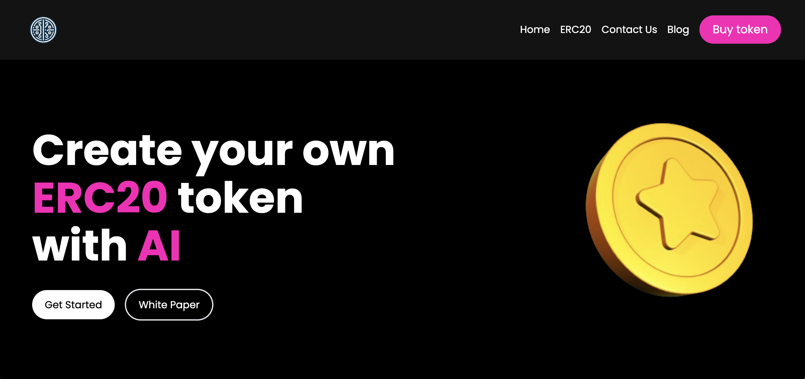

# AICoinGen

<p align="center">
    <a href="https://www.youtube.com/watch?v=OpL5Q7Zc7qk" title="Project Demo">🖥️ Video</a>
    .
    <a href="https://github.com/mendsalbert/AICOINGEN" title="GitHub Repository">📂 Repo</a>
    ·
    <a href="https://github.com/mendsalbert/AICOINGEN/issues" title="Report Bug/Request Feature">🚀 Got Issue</a>
</p>
<a href="" title="Project Screenshot">
    
</a>

## Inspiration 💡

In today's rapidly evolving digital world, there's a growing need for innovative tools that leverage artificial intelligence to simplify complex tasks. AICOINGEN was inspired by the potential of combining AI and decentralized finance (DeFi) to create a seamless, user-friendly platform for generating and managing ERC20 tokens. The goal was to empower users with an AI-driven solution that can suggest unique coin names and facilitate the creation of ERC20 tokens effortlessly.

## What it Does ⚙️

AICOINGEN is an AI-powered DeFi application designed to revolutionize how users create and manage ERC20 tokens. Here are some of its standout features:

- **AI-Driven Coin Name Generation:** Uses advanced AI algorithms to suggest unique and catchy coin names.
- **ERC20 Token Creation:** A user-friendly interface for creating ERC20 tokens on the Polygon Cardona Testnet.
- **AICG Token:** The platform's native cryptocurrency, which powers various functionalities within the app.
- **Chainlink Price Feed:** Integrates Chainlink Price Feeds to provide real-time price data for transactions.
- **Chainlink Functions:** Utilizes Chainlink Functions for off-chain AI computations and bringing the results back on-chain.
- **Donation System:** Users can donate MATIC to support the platform.
- **Real-Time Dashboard:** Provides a comprehensive overview of created tokens, donations, and other key metrics.

## How We Built It 🛠️

AICOINGEN is built using a combination of cutting-edge technologies:

- **Blockchain Backend:** Developed using Solidity, smart contracts on the Polygon Cardona Testnet provide a secure and decentralized backend for token management.
- **Chainlink VRF & Price Feeds:** Used for generating unique identifiers and real-time price data.
- **Chainlink Functions:** Powers the AI-driven coin name generation by performing off-chain computations.
- **IPFS:** Ensures decentralized and secure storage of user data.
- **React and Next.js:** Powers the dynamic and responsive front end.
- **Tailwind CSS:** Facilitates rapid UI development with its utility-first framework.

### Prerequisites

Ensure you have the following installed:

- [Node.js](https://nodejs.org/en/)
- [Git](https://git-scm.com/)
- [npm](https://www.npmjs.com/)
- [Hardhat](https://hardhat.org/)
- Metamask (or any other Ethereum wallet)
- Chainlink VRF setup (with LINK tokens)
- IPFS setup

### Installation Steps

1. **Clone the repository:**

```bash
git clone https://github.com/mendsalbert/AICOINGEN.git
cd aicoingen
```

2. **Install Dependencies:**

```bash
npm install
```

3. **Compile the Contracts:**

```bash
npx hardhat compile
```

4. **Deploy the Contracts:**

```bash
npx hardhat run scripts/deploy.js --network zkEVMCardonaTestnet
```

5. **Run the Development Server:**

```bash
npm start
```

6. **Open the App:**

Navigate to `http://localhost:3000` in your web browser.

**🎇 You are Ready to Go!**

### Configuration

To deploy to a test or main network, update the configurations located in `hardhat.config.js` to use a private key and deploy to the Polygon zkEVM Cardona Testnet.

```javascript
require("@nomiclabs/hardhat-waffle");
const fs = require("fs");
const { ethers } = require("ethers");
const wallet = ethers.Wallet.fromMnemonic(seedPhrase);
const privateKey = wallet.privateKey;

module.exports = {
  defaultNetwork: "hardhat",
  networks: {
    zkEVMCardonaTestnet: {
      url: "https://polygon-zkevm-cardona.blockpi.network/v1/rpc/public",
      accounts: [privateKey],
    },
  },
  solidity: "0.8.24",
  allowUnlimitedContractSize: true,
  throwOnTransactionFailures: true,
  throwOnCallFailures: true,
};
```

## Smart Contract Overview

The main contract, `LookUpContract`, manages ERC20 tokens and donations.

### Key Functions

- **createERC20Token:** Creates a new ERC20 token with specified details.
- **getAllERC20TokenListed:** Retrieves all listed ERC20 tokens.
- **getERC20Token:** Retrieves details of a specific ERC20 token by ID.
- **getUserERC20Tokens:** Retrieves all ERC20 tokens owned by a specific user.
- **donate:** Allows users to donate MATIC to the platform.
- **getAllDonation:** Retrieves all donations made to the platform.
- **sendRequest:** Sends a request to OpenAI via Chainlink Functions for coin name suggestions.
- **fulfillRequest:** Handles the response from OpenAI and processes it.

## Contributing

We welcome contributions to AICOINGEN! To contribute, please follow these steps:

1. Fork the repository.
2. Create a new branch for your feature or bug fix.
3. Make your changes and commit them.
4. Push your changes to your fork.
5. Submit a pull request to the main repository.

## License

This project is licensed under the MIT License. See the [LICENSE](LICENSE) file for details.
